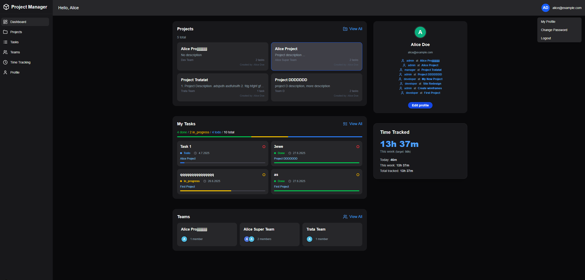
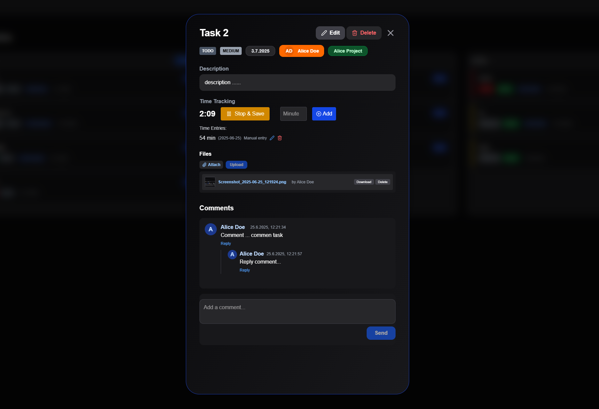
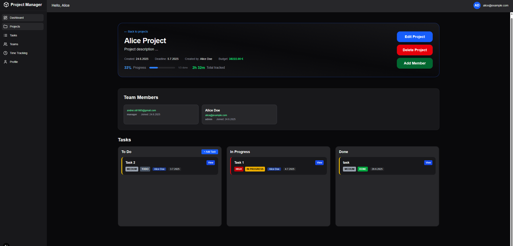
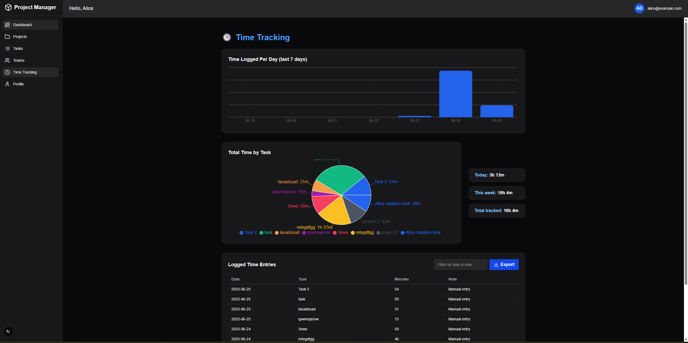

# Project Manager

This is the **backend API** for the Project Management System. It is built with **Django**, **Django REST Framework**, and **Channels** for real-time WebSocket support.

Project Manager is a full-stack web application that helps teams collaborate efficiently through task management, time tracking, team roles, and project organization. Built with Django REST Framework and Next.js, it features a professional Kanban interface, real-time updates, and a modern user experience.


## 💻 Preview

This project offers a modern UI with key features such as task management, time tracking, and team collaboration. Below are a few screenshots that demonstrate the main functionalities:

* Clean Dashboard
* Kanban Task View
* Project Overview with Member Roles
* Integrated Time Tracker
## 📸 Screenshots

### Dashboard


### My Tasks


### Task View


### Project Details


### Time Tracking



## 🚀 Features

- User authentication and registration (JWT)
- Project and task management
- Kanban-style task board with drag-and-drop
- Role-based team system (invite, accept, remove)
- File attachments and comments for tasks
- Time tracking system
- Real-time notifications via WebSockets

## ⚙️ Tech Stack

- Django 5.2
- Django REST Framework 3.16
- Channels + Daphne + Redis
- SimpleJWT for authentication
- SQLite (default, easy to change)
- pytest for testing

## 📁 Project Structure

project-manager-api/

├── apps/ # Django apps: users, projects, tasks, teams, time, etc.

├── config/ # Django settings and URL config

├── tests/ # Backend tests with pytest

├── frontend/ # Frontend part

├── media/ # Uploaded media files

├── db.sqlite3 # Default development database

├── requirements.txt # Python dependencies

└── manage.py


## ▶️ Setup & Run

1. Create a virtual environment and install dependencies:

```bash
python -m venv venv
source venv/bin/activate  # or venv\Scripts\activate on Windows
pip install -r requirements.txt
python manage.py migrate
python manage.py runserver
