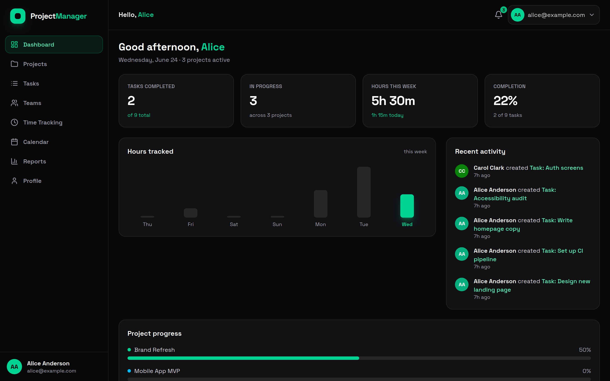
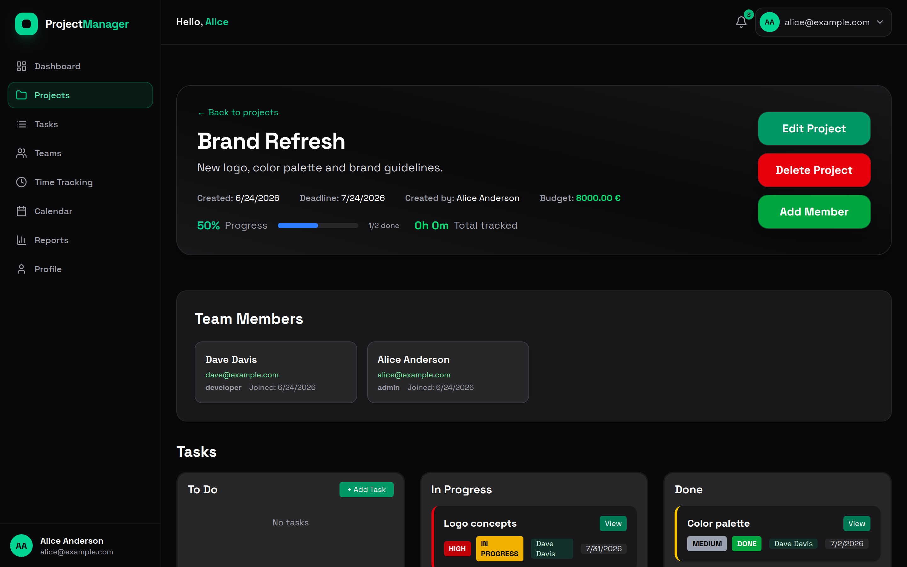
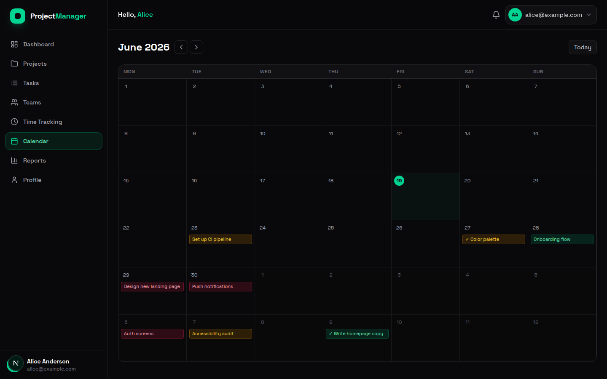
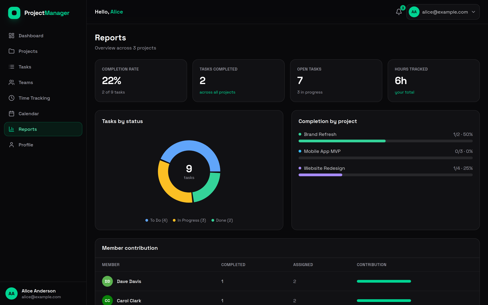
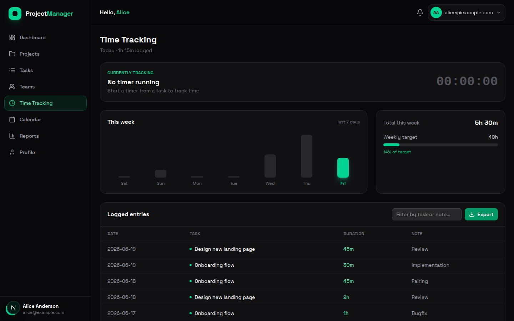
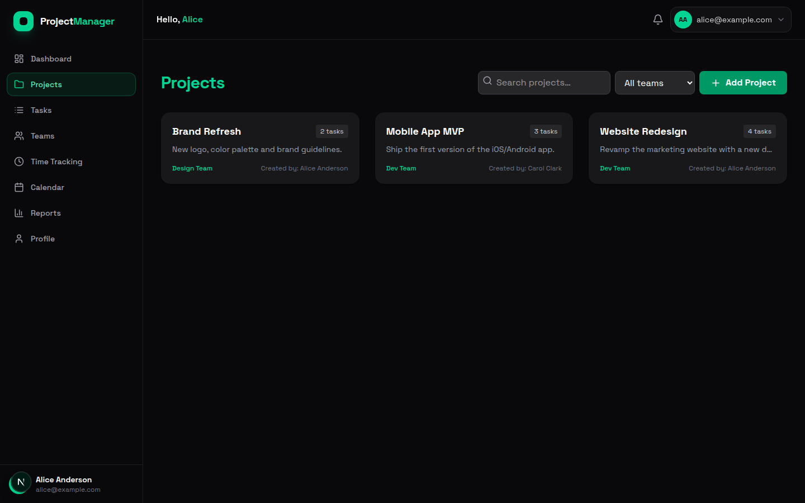
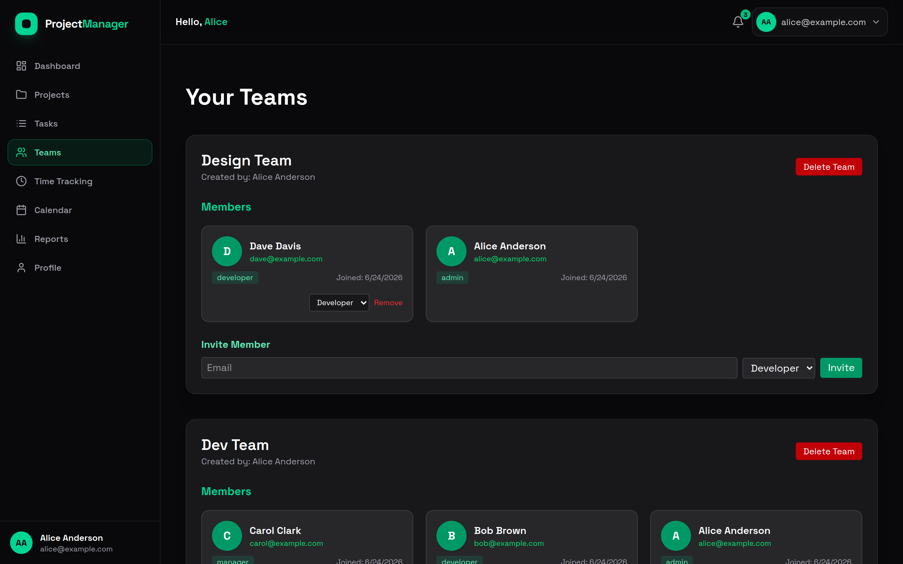

# Project Manager

A full-stack team-collaboration platform — Kanban boards, time tracking, team
roles, a calendar, analytics and **real-time notifications**. Built with a
Django REST + Channels backend and a Next.js frontend.

<p align="center">
  
</p>

---

## ✨ Features

- **Authentication** — JWT (access/refresh) with register, login, logout
  (refresh-token blacklist) and password reset.
- **Teams & roles** — invite members, roles (admin / manager / developer),
  with a guard that a team always keeps at least one admin.
- **Projects & tasks** — Kanban board with drag-and-drop, priorities,
  assignees, due dates, threaded comments and file attachments.
- **Time tracking** — live timer, manual entries, weekly target, charts and
  CSV export.
- **Calendar** — monthly view of tasks placed on their due dates.
- **Reports** — completion rate, status breakdown (donut), per-project
  progress and a member-contribution table.
- **Real-time notifications** — WebSocket bell that lights up instantly when
  you're assigned a task or someone comments on yours.
- **Activity feed** — audit log of who did what, across the workspace.
- **API documentation** — interactive Swagger UI at `/api/docs/`.

## 🖼️ Screenshots

| Kanban board | Calendar |
| --- | --- |
|  |  |

| Reports | Time tracking |
| --- | --- |
|  |  |

| Projects | Teams |
| --- | --- |
|  |  |

## 🧰 Tech stack

**Backend** — Python 3.12 · Django 5.2 · Django REST Framework 3.16 ·
Channels + Daphne (WebSockets) · SimpleJWT · drf-spectacular (OpenAPI) ·
django-filter · WhiteNoise · PostgreSQL / SQLite · Redis (channel layer) ·
pytest.

**Frontend** — Next.js 15 (App Router) · React 19 · TypeScript · Tailwind
CSS 4 · Zustand · Recharts · @hello-pangea/dnd · Axios.

**Infra** — Docker · docker-compose · GitHub Actions CI.

## 🏗️ Architecture

Django apps under `apps/`, each owning its models, serializers, views and
permissions:

| App | Responsibility |
| --- | --- |
| `users` | custom user (email login), auth, password reset |
| `teams` | teams, memberships, roles, invitations |
| `projects` | projects |
| `tasks` | tasks (Kanban, status, priority, assignees) |
| `comments` | threaded task comments |
| `taskfiles` | task file attachments |
| `timetrack` | time entries and summaries |
| `notify` | notifications + WebSocket consumer |
| `logs` | activity / audit log |

## 🚀 Getting started (local)

Requirements: Python 3.12, Node.js 22. Redis/PostgreSQL are optional in dev
(SQLite and an in-memory channel layer are used by default).

### Backend

```bash
python -m venv venv && source venv/bin/activate
pip install -r requirements.txt
cp .env.example .env            # set SECRET_KEY and ENVIRONMENT=development
python manage.py migrate
python seed_demo.py             # optional: rich demo data
python manage.py runserver      # http://localhost:8000
```

### Frontend

```bash
cd frontend
cp .env.example .env.local      # NEXT_PUBLIC_API_URL=http://localhost:8000/api
npm install
npm run dev                     # http://localhost:3000
```

**Demo login:** `alice@example.com` / `12345678` (after running `seed_demo.py`).

- App: <http://localhost:3000>
- API docs (Swagger): <http://localhost:8000/api/docs/>

## 🐳 Run with Docker

The full production-like stack (PostgreSQL + Redis + Django/ASGI + Next.js)
in one command:

```bash
cp .env.example .env            # set a strong SECRET_KEY
docker compose up --build
```

## ✅ Tests & quality

```bash
pytest                          # backend: 100 tests
python manage.py check --deploy # security checklist (clean in production)

cd frontend && npm run lint && npm run build
```

## 🔒 Security highlights

Secure-by-default permissions, object-level authorization, JWT with
refresh-token blacklist, **rate limiting** on auth endpoints, password-strength
validation, upload type/size validation, and production security headers
(HSTS, secure cookies, SSL redirect) gated behind `ENVIRONMENT`.

## 📄 License

See [LICENSE](LICENSE).
